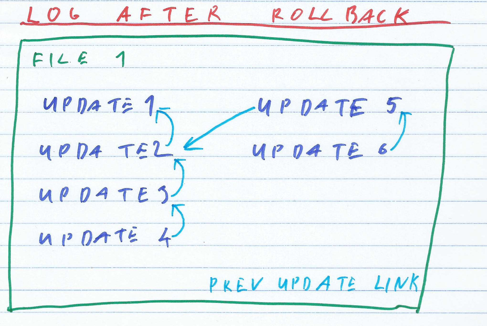
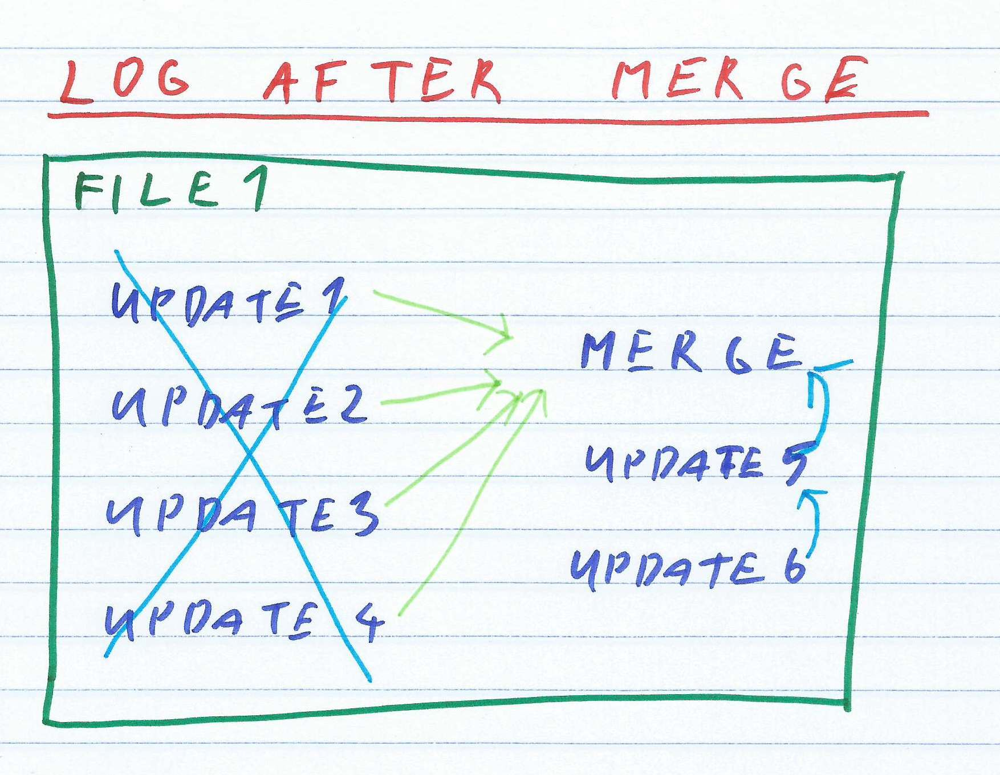
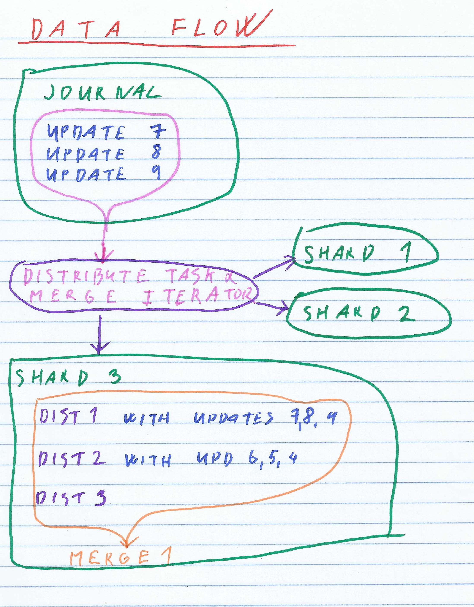

IODB design specification
============================

This document outlines design and implementation of IODB database at 0.4 release.

Basic terms
-----------

This spec assumes basic knowledge of log structured stores.
Here are some basic terms

### Log
- Log is sequence of updates organized by time
    - This sequence might not follow actual organization of data, it can be reorganized by rollback or compaction
- Log can be spread over multiple files.
- Each Log Entry contains:
    - list of update keys
    - list of deleted keys (see tombstone)
    - link to previous update

- Key-Value pair is found by traversing Log until key is found
    - rollback or Compaction can reorganize sequence of updates
    - search follows link to previous update in Log Entry, rather than sequentially traversing log file in reverse order

### State of store
- content of store for given VersionID (or most recent update)
- all key-value pairs in store

### Tombstone

- Already inserted data are immutable. It is not possible to delete keys directly from store.
- Deleted keys are indicated by **tombstone** marker
    - it is special type of value
    - in binary storage is indicated by value with length `-1`
- Compaction eventually removes tombstones from store and reclaims the disk space

### VersionID
- Each Update takes VersionID as a parameter
- Each Update creates snapshot of data
- This snapshot is identified (and can be reverted to) by `byte[]` identifier

### Binary Search

- Keys in each update entry are sorted
- To find a key binary search is used
- It compares `byte[]` (or `ByteArrayWrapper`) with content of file
- All keys have equal size, that simplifies the search significantly
- 0.4 version uses `FileChannel` which is very slow
    - memory mapped file can speedup binary search 10x
    - unsafe file access is even faster

### Merge iterator

- state of store (all key-value pairs) is reconstructed by replaying all updates from start to end
- easiest way is to traverse log and insert key-value pairs into  in-memory `HashMap`
    - that consumes too much memory

- IODB uses Merge iterator (lazy-N-way merge) instead

- Inside each Update Entry (such as V1, V2...), keys are stored in sorted order.

- Compaction reads content of all  Updates  in parallel, and produces the result by comparing keys from all updates.

- The time complexity is `O(N*log(U))`, where `N` is the total number of keys in all Updates and `U` is the number of Updates (versions) in merge.

- Compaction is streaming data; it never loads all keys into memory. But it needs to store `U` keys in memory for comparison.

- If `U` is too large, the compaction process can be performed in stages.

- No random IO, as all reads are sequential and all writes are append-only.

### Merge in log

As the number of updates grows and the linked-list gets longer, Find Key operation will become slow
Also obsolete versions of keys are causing space overhead.

Both problems are solved by merging older updates into a single update.
The merge is typically performed by a compaction process,
which runs on the background in a separate thread.

- Merge process takes N Updates
    - from most recent
    - until previous Merge Entry or start of the log
- It produces Merge Iterator over this data set
- It inserts current state of store into Log Entry

- 0.4 serializes Merge Entry into `byte[]` using `ByteArrayOutputStream`
    - it can run out of memory
    - temporary file should be used instead

### Shards

- If store contains too many Key-Value pairs, Merge or binary search becomes slow
- So the store is split into Shards, each Shard is compacted and managed separately
- Newer data are stored in single log (Journal) latter moved into Shards

Data lifecycle
------------------

IODB moves data around to ensure good performance

### Update

Modifications (updated key-value pairs and keys to delete) are inserted in
batches (here referred as updates).
Each Update is identified by `VersionID` and creates new snapshot which
can be rolled back to.

Over time data (key-value pairs) move following way:

- journal contains most recent updates
- over time journal becomes too long, so Distribute Task is triggered
- at start Distribute Task inserts Distribute Placeholder entry into Journal
- Distribute Task moves data from Journal into Shards
- after Distribute Task finishes, it puts file positions in Shards into Journal
- over time (after some Distribute Tasks are finished) some Shards become too long, this triggers Shard Merge task
- Shard Merge tasks select longest Shard and merges content from multiple Update Entries into single Merge Entry

### find key (get)

`Store.get()` returns value associated with the key, or `None` if key is not found

- search traverses journal, until Distribute Placeholder is found (or key is found)
- from Distribute Entry it takes position in Shard
- search continues by traversing Shards from given position
- search finishes when
    - key is found
    - Merge Entry is found in Shard
    - end of Shard is reached

FIG find key

### get all

`Store.getAll()` returns content of store (all key-value pairs) for given `VersionID`.

Content is merged in a following way:

- traverse Journal until Distribute Placeholder is found
- take all data in Journal from VersionID until Distribute Placeholder
    - merge them into single data set
    - store it in temporary file (is currently done in-memory and that causes out-of-memory exceptions)
    - this is referred here as Journal content
- iterate over content of shards and merge them with Journal content
    - Shards are not overlapping
    - Journal content is sorted
    - Shard and Journal content is merged on single iteration

FIG get all

Rollback
----------

Rollback reverts store into state at given VersionID. It discards data inserted after
given VersionID.

Log is chain of updates. It is not possible to overwrite new updates during rollback.
So the new update (Offset Alias Log entry) is written into Journal.
It instruct search and other operation to skip irrelevant data while traversing the log.

Rollback is performed in following way
- traverse Journal until matching VersionID is found
- continue Journal traversal until Distribute Entry is found
    - this is first distribute entry after VersionID
    - we need Shard positions for given VersionID
- insert Offset Alias Log Entry into journal
- rollback Shards into state found in Distribe Entry

FIG state of log after rollback

Shards
------

- binary search on large tables is slow, also compaction on large tables is slow
- only most recent data are stored in Journal
- older data are distributed into shards
- there is Distribute Task, it takes data from Journal and distributes them into Shards

### Shard Splitting

- ideally Shards should be created dynamically
    - small or empty store starts with single shards
    - if Shard becomes too big, it is sliced into several smaller Shards
    - if Shard becomes too small, it is merged into its neighbours

- dynamic Shard allocation has following advantages
    - less configuration, number of shard scales with store size
    - Shard Boundaries are self-balancing
        - if Key Space is sliced at constant intervals, and key distribution is not random (for example incremental keys), most keys can end in single interval
        - with dynamic Shard allocation new shards are created by slicing old Shards.

- 0.4 release has **static sharding**
    - `ShardedStore` has `shardCount` parameter
        - this is hardcoded into store and can not be changed
    - key space is sliced at constant interval
    - dynamic Sharding was in 0.3 release, but caused concurrency issues

FIG shard splitting dymamic allocation

FIG shard splitting static allocation 

File naming
----------------------

- Log is composed of multiple files
- IODB stores data in directory
    - this dir contains multiple logs (Journal and Shards)
    - it also contains temporary files

- Each file has prefix, file ID and suffix

- Prefix identifies type of file (journal, shard, temp)
    - It also assigns file into its Log (Journal or Shard)

- File ID gives position of file within log
    - TODO File ID should have two parts; log file position and file version

- Suffix is not used
    - TODO drop suffix or use it to identify temp files

- Temporary files are used
    - To produce merged result during compaction and distribute (TODO currently uses `byte[]`)
    - To store large updates
    - To store result of `getAll()` operation (TODO currently loaded into in-memory `TreeMap`)

File handles and File IO
------------------------

- IODB performs following IO operations on files
    - append at end of the file
    - sync; flush write cache on file (temp files are not flushed)
    - binary search read

- IODB keeps number of files open
    - one writeable handle to append to Journal
    - one readonly handle for each file

- File handle is limited resource
    - by default only 64K handles are allowed per process on Linux
    - exhausting file handles can cause JVM to crash (it can not open DLLs or JAR files)

- IODB keeps file handles in `LogStore.fileHandles` map

- File handle can be `FileChannel` or `MappedByteBuffer` depending on implementation

- 0.4 release uses `FileChannel` to perform binary search, but this is slow
    - future version should use memory mapped files, or `sun.misc.Unsafe` to perform search
    - this can speedup search 10x
    - but it also has various problems outlined [in this blog post](http://www.mapdb.org/blog/mmap_files_alloc_and_jvm_crash/)

- file delete
    - IODB needs to delete outdated files
    - files can not be deleted while it is opened for reading (race condition)
        - other threads could fail, while reading data from store
        - memory mapped file crashes (segfault) when accessing unmapped buffer
    - there is semaphore for each file
        - it protects file from deletion while it is read from
        - each read operation needs to lock files it will use
        - see `LogStore.fileSemaphore` for details

- mmap files and close
    - file locking for read & delete

- remap file when it grows

- unsafe file access
    - jvm crash & read only file

- binary search performance

Background Operations
--------------------------

- background executors versus manual execution
-

### Distribute Task

- triggered when number of updates in journal is over limit
    - TODO perhaps trigger by space consumed by updates, rather by their count

FIG distribute task

### Compact Task

- triggered every N second
- finds shard with most unmerged updates

### File Shring Task

FIG shring file

Concurrency
-----------

### Internal State

#### File reopen (restore internal state)

### Atomicity
### Rollback
### Distribute task
- distribute task

### Merge task

Source code overview
------------------------

### ShardedStore

#### parameters

- dir
- keySize
- shard count
- executor

#### Concurrency

- distributeLock

#### journal
#### locks and executors
#### taskMerge

### LogStore

### serialize methods
### append methods

### QuickStore

### Utils

File format overview
-----------------------

Binary format is described in `store_format.md`

In short log can contain following types of entries:

- **update log entry** - Is inserted on each update
- **merge log entry** - Is inserted by Compaction Task, merges content from multiple updates into single log entry
- **distribute placeholder log entry** - Inserted into journal when distribute task starts.
- **distribute log entry** - Inserted into journal after distribute task finishes. It contains pointers into shards.
- **offset alias log entry** - inserted by Rollback or Compaction Task. It replaces Update Entry with new one. For example after compaction the most recent update is replaced by Compacted Entry.

Unit tests
-------------------

Unit tests are organized in following packages:

XXX

Issues
------

-

- getAll() loads all data on heap, use merge iterator

- serialize update into `byte[]`

- compaction is slow

- memory leak in

Mutable global variables in ShardedStore
----------------------------------------

Ideally store would keep zero state outside of file.
But that would mean each read operation would have to replay all journal modifications,
to find most recent Update.
For that Store contains some mutable variables.

### journalUpdateCounter
TODO merge this with `journal.umergedUpdatesCounter`

### Variables in journal

#### eofPos

#### validPos

#### unmergedUpdatesCounter

- restored by replay

#### offsetAliases

#### Variables in each shard

#### eofPos

#### validPos

#### unmergedUpdatesCounter
- restored by replay, but shards are not replayed on reopen

#### offsetAliases

Internal state and concurrency
------------------------------

here is list of operations which modify internal state (files and Store internal variables.
and how those are protected from race conditions and deadlocks

### Update
- TODO start new file only in distribute/merge?

### Open File

### Distribute Task
- start new file conditions

### Shard Merge Task
- start bew file

### File Compaction Task

### Rollback

### Clean and file delete